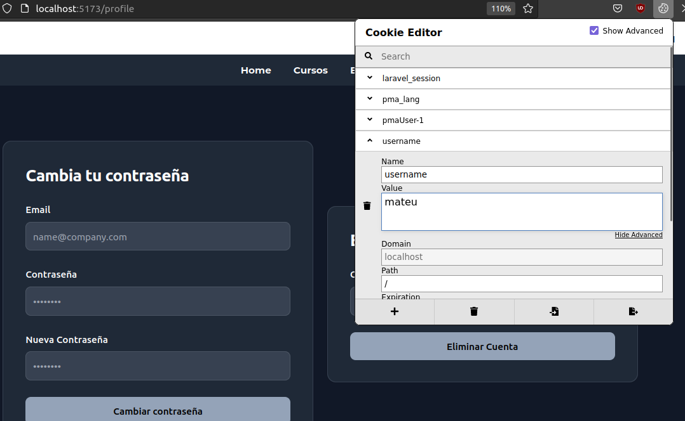
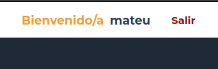

# PadelClass Vue Project

## VUE-3

Este proyecto ha sido realizado con Vue-3, se han utilizado algunas cosas especificas de Vue como:

- ##  Router
    El router de Vue define cada ruta  junto con el router link para conectarlas entre si.

    La mayoría de las rutas están en el header, aunque hay algunos botones que te pueden direccionar a otras vistas.

    Ha sido utilizado el método go(-1) de router para poder redireccionar una página hacia atrás al usuario cuando es logueado. 
- ## Paquete de Cookies

    Las Cookies utilizadas principalmente son para el sistema de login utilizado, el nombre de usuario es guardado en las cookies, asi puede ser usado para el panel de control de usuario con funcionalidades como el cambio de contraseña y la eliminación de la cuenta.

      

- ## Componentes y Classes dinàmicas

    
- ## Vistas

La página web tiene un total de 7 vistas, las cuales serian:

- HOME

Información básica sobre la página y lo que puede contener.

- SHOW All Cursos

Enseña todos los cursos posibles, también dispone de un sistema de filtros para poder elegir los cursos por nivel y cursos gratuitos.

- GET ONE Curso

Esta vista dinámica enseña el curso elegido de la vista get all.

- GET ALL Equipo

Aqui encontrarás un get all del equipo actual.

- LOGIN

Un login con un formulario simple, comprueba si el usuario ha sido creado y esta en db.json, después crea una cookie con el nombre del usuario logueado.

- REGISTER

Formulario sin validación, hace un insert en la db.json.

- GESTION USUARIO/PERFIL

Cambio de contraseña y eliminación de cuenta aprovechando el uso de cookies accede al nombre de usuario de estas complementando a ambos formularios, con esto el CRUD sobre usuario esta al completo.

### Observaciones

Si no se han utilizado v-bin o v-model ha sido por el uso de clases dinámicas que me aportaban lo mismo.
